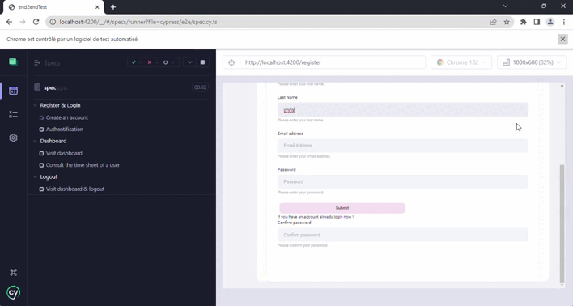

# End To End Testing

This project is  a web application that helps manage employees' working hours.

## Technologies
This project was generated with 
 * Frontend : [Angular CLI](https://github.com/angular/angular-cli) version 13.3.5. 
 * Backend : [NodeJs/ExpressJs](https://nodejs.org/en/) version 16.14.2.

## Test
I used the  [ Cypress](https://www.cypress.io/) framework version 10.0.2 to create end-to-end tests.

## Use cases tested 
 * Create an account
 * Sign in 
 * Consult the employee dashboard
 * Consult an employee working hours
 * Logout

## Result 

