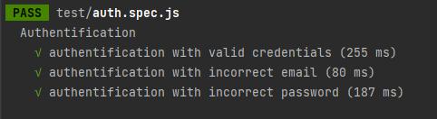
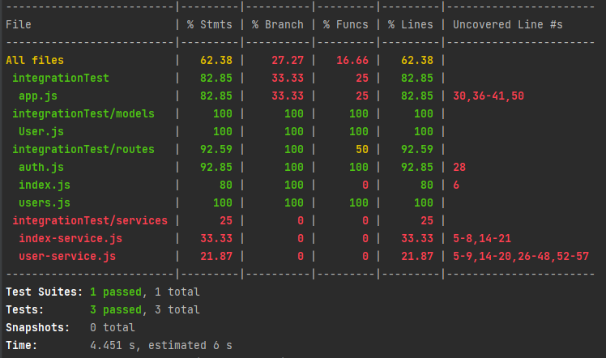
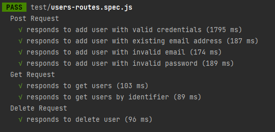
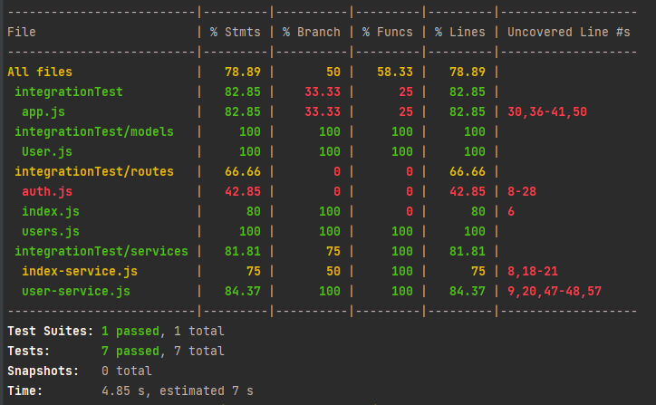

# Integration  Testing

This project is a backend application to manage users.

## Technologies
This project was generated with  
 *  [NodeJs/ExpressJs](https://nodejs.org/en/) version 16.14.2.

## Test 
I used the framework [Jest](https://jestjs.io) to create integration tests.

## Test suites
 * Authentification

  
  
  

 * CRUD user

  
  
  
